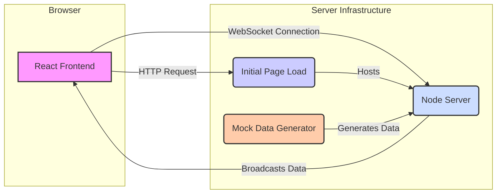

# System Architecture: Real-Time Analytics Dashboard (TypeScript)

This document outlines the architecture, data flow, and technical details of the Real-Time Analytics Dashboard application, implemented using TypeScript.

## 1. System Architecture Diagram

The diagram below illustrates the main components and interactions within the system.



**Components:**

*   **React Frontend (.tsx):** The user interface built with React and TypeScript, running in the user's browser. Responsible for rendering the dashboard components and managing the WebSocket connection.
*   **Node.js/Express Server:** Backend server written in TypeScript (compiled to JS). Hosts the WebSocket server.
*   **WebSocket Server (`ws`):** Attached to the Node.js HTTP server. Manages client connections and broadcasts data updates.
*   **Mock Data Generator:** A TypeScript function within the Node.js server that periodically simulates new website traffic data.

## 2. Data Flow Explanation

1.  **Initial Load:** The user accesses the web application URL. The React application (`.tsx` files compiled to JS) is loaded into the browser.
2.  **WebSocket Connection:** The React frontend (`Dashboard.tsx` component) initiates a WebSocket connection to the backend WebSocket server (`ws://localhost:8080`).
3.  **Connection Established:** The backend WebSocket server (`server.ts`) accepts the connection and adds the client to its list of active connections. It might send an initial data payload immediately upon connection.
4.  **Mock Data Generation:** On the backend, a `setInterval` loop runs periodically (e.g., every 2 seconds). In each interval, the `generateMockData` function creates a new JSON object containing simulated `active_users`, `page_views`, and `avg_session_duration`.
5.  **Data Broadcast:** The WebSocket server iterates through all currently connected clients and sends the newly generated JSON data packet (typed as `AnalyticsData` on the server) to each one using `client.send()`.
6.  **Frontend Reception:** The React frontend's WebSocket `onmessage` handler receives the data packet.
7.  **State Update:** The received JSON data is parsed (potentially asserting type `AnalyticsData` from `types.ts`). React's `useState` hooks (`useState<number | null>`, `useState<PageViewDataPoint[]>`) are used to update the application's state with the new values. The `pageViewsHistory` state appends the new data point and truncates the array to maintain a fixed history length for the chart.
8.  **UI Re-render:** React detects the state changes and automatically re-renders the affected components (`ActiveUsersCard`, `PageViewsChart`, `AvgSessionDurationGauge`) with the updated data, providing the real-time effect without a page refresh.
9.  **Disconnection:** If the user closes the browser tab or the connection is lost, the `onclose` event triggers on both client and server. The server removes the client from its broadcast list. The client attempts reconnection after a delay.

## 3. Tech Stack Breakdown

*   **Frontend:**
    *   **React:** JavaScript library for building user interfaces.
    *   **TypeScript:** Language for static typing.
    *   **Recharts:** Declarative charting library for React.
    *   **CSS:** Styling the components.
    *   **WebSocket API (Browser):** Native browser API for establishing WebSocket connections.
*   **Backend:**
    *   **Node.js:** JavaScript runtime environment for the server.
    *   **Express:** Minimalist web framework for Node.js (used here mainly to host the WebSocket server).
    *   **`ws` Library:** Popular Node.js library for implementing WebSocket servers and clients.
    *   **TypeScript:** Language for static typing.
*   **Development/Build:**
    *   **npm:** Package manager for Node.js.
    *   **Create React App / Vite (TS):** Toolchain for bootstrapping and managing the React application development environment.
    *   **`tsc`:** TypeScript Compiler.
    *   **`@types/*`:** Type definition packages.

## 4. Real-Time Logic Flow

*   **Server (`server.ts`):**
    *   Initialize `WebSocketServer`.
    *   Use `wss.on('connection', (ws: WebSocket) => ...)`: Type the `ws` parameter.
    *   Use `setInterval` to call `generateMockData()`.
    *   Inside the interval callback: Get typed `AnalyticsData`. Iterate through `wss.clients` (typing `client` as `WebSocket`). If `client.readyState === WebSocket.OPEN`, send the JSON stringified data using `client.send()`.
*   **Client (`Dashboard.tsx`):**
    *   Use `useRef<WebSocket | null>` to hold the WebSocket instance (`ws.current`).
    *   Use `useEffect` with an empty dependency array `[]` to run connection logic once on mount.
    *   Inside `useEffect`: Create `new WebSocket(URL)`.
    *   Define `ws.current.onopen`: Log success.
    *   Define `ws.current.onmessage`: Parse `event.data`, potentially assert type `as AnalyticsData`. Update component state (`activeUsers`, `avgSessionDuration`, `pageViewsHistory`) using setter functions.
    *   Define `ws.current.onclose`: Log disconnection, potentially schedule a reconnect attempt using `setTimeout`.
    *   Define `ws.current.onerror`: Log errors, potentially close the connection manually before attempting reconnect.
    *   Return a cleanup function from `useEffect` that calls `ws.current.close()` to ensure the connection is closed when the component unmounts.

## 5. Mock Data Design

*   **Structure (TypeScript Interface - `AnalyticsData`):**
    ```typescript
    interface AnalyticsData {
        timestamp: string;
        active_users: number;
        page_views: number;
        avg_session_duration: number;
    }
    ```
*   **Generation Logic (`generateMockData` in `server.ts`):**
    *   **`active_users`:** Starts with a base value. In each interval, adds a random integer between -10 and +10. Clamped within a min/max range (e.g., 30-200).
    *   **`page_views`:** Calculated based on the current `active_users` multiplied by a random factor (e.g., `1 + Math.random()`) to simulate variability. A minimum value is enforced.
    *   **`avg_session_duration`:** Starts with a base value. In each interval, adds a random float between -0.5 and +0.5. Clamped within a min/max range (e.g., 1.5 - 10.0).
    *   **`timestamp`:** Generated using `new Date().toISOString()`.
*   **History Management (Client - `Dashboard.tsx`):**
    *   The `pageViewsHistory` state is typed as `useState<PageViewDataPoint[]>`.
    *   The `PageViewDataPoint` type is defined in `types.ts`.
    *   Logic for appending and slicing remains the same.
